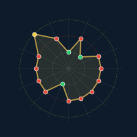
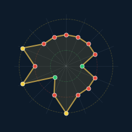
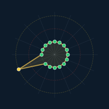
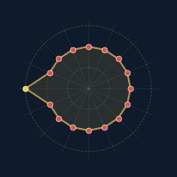
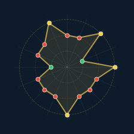
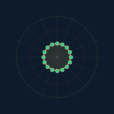

# SVcustos — Dataset para Entrenamiento de CNN

**Clasificación visual de vectores ternarios de intrusión mediante polígonos polares y ResNet**

[](https://creativecommons.org/licenses/by-nc-nd/4.0/)
[](https://orcid.org/0000-0002-6634-3351)

---

## Descripción

Este repositorio contiene el pipeline completo para generar datasets de imágenes de polígonos polares ternarios y entrenar redes neuronales convolucionales (ResNet) para la clasificación automática de vectores del sistema SVcustos.

Cada vector ternario de *n* parámetros (valores: 0, 1, U) se transforma en un polígono polar y se clasifica como **INTRUSIÓN**, **INDETERMINADO** o **NORMAL** según la regla estricta del sistema.

### Ejemplos de imágenes del dataset (n=16)

Cada vector ternario se transforma en un polígono polar de 16 ejes. Los vértices se colorean por valor: 🔴 1 (activo) · 🟢 0 (normal) · 🟡 U (indeterminado). El estilo visual es idéntico para todas las clases — la CNN aprende del patrón geométrico, no del color de clase.

| INTRUSIÓN (n₁ ≥ 12) | INDETERMINADO | NORMAL (n₀ ≥ 12) |
|:---:|:---:|:---:|
|  |  |  |
|  |  |  |

### Niveles soportados

| Documento | n | Capas | Espacio 3ⁿ | Umbral (T = ⌊7n/9⌋) | Clase minoritaria |
|-----------|---:|------:|------------:|--------------------:|------------------:|
| Doc 2     | 16 | 4×4   | 43.046.721  | n₁ ≥ 12             | 34.113            |
| Doc 3     | 25 | 5×5   | ~847×10⁹    | n₁ ≥ 19             | 13.256.611        |
| Doc 4     | 36 | 6×6   | ~1,5×10¹⁷   | n₁ ≥ 28             | ~8,9×10⁹          |

El umbral de cada nivel coincide con el campo `threshold_intrusion` de los ficheros
de configuración `config/n16.yaml`, `config/n25.yaml` y `config/n36.yaml`.

---

## Inicio rápido

### 1. Instalar dependencias

```bash
pip install -r requirements.txt
```

Para GPU (recomendado para entrenamiento):

```bash
pip install torch torchvision --index-url https://download.pytorch.org/whl/cu121
```

### 2. Generar el dataset

Ejemplo para el nivel n=16 (Doc 2):

```bash
python generate_dataset.py --level n16
```

Ejemplos análogos para n=25 y n=36 (Doc 3 y Doc 4):

```bash
python generate_dataset.py --level n25
python generate_dataset.py --level n36
```

Por defecto se crean 3.000 imágenes (1.000 por clase) en `data/nXX/` con estructura
tipo `ImageFolder`. Para n=16, la estructura es:

```text
data/n16/
  train/
    INTRUSION/        (700 imágenes)
    INDETERMINADO/    (700 imágenes)
    NORMAL/           (700 imágenes)
  val/
    INTRUSION/        (150 imágenes)
    INDETERMINADO/    (150 imágenes)
    NORMAL/           (150 imágenes)
  test/
    INTRUSION/        (150 imágenes)
    INDETERMINADO/    (150 imágenes)
    NORMAL/           (150 imágenes)
```

### 3. Entrenar el modelo

Ejemplo para n=16:

```bash
python train_resnet.py --level n16
```

Para otros niveles:

```bash
python train_resnet.py --level n25
python train_resnet.py --level n36
```

### 4. Evaluar

Ejemplo para n=16:

```bash
python evaluate.py --level n16 --model models/svcustos_n16_resnet34_*.pth
```

(Análogo para n=25 y n=36 cambiando `--level` y el nombre del modelo.)

---

## Diseño del dataset

### Imágenes neutrales

Las imágenes de los polígonos polares usan un **estilo visual neutro** idéntico para todas las clases. La CNN debe aprender a clasificar a partir del **patrón geométrico** del polígono, no de colores de clase.

- **Fondo**: oscuro uniforme (#0D1B2A)
- **Polígono**: contorno y relleno dorado (mismo para todas las clases)
- **Vértices**: coloreados por *valor* del parámetro (0=verde, 1=rojo, U=amarillo)
- **Anillos de referencia**: tres círculos discontinuos a radio 1, 2, 3
- **Resolución**: 224×224 px (entrada nativa de ResNet)

### Regla de clasificación

Para un vector de *n* parámetros con valores ternarios {0, 1, U}:

- **INTRUSIÓN**: n₁ ≥ umbral (donde n₁ = número de parámetros con valor 1)
- **NORMAL**: n₀ ≥ umbral (donde n₀ = número de parámetros con valor 0)
- **INDETERMINADO**: resto

Con:

> umbral T = ⌊7n/9⌋

Este mismo valor se fija en el campo `threshold_intrusion` de cada fichero
`config/nXX.yaml` para garantizar coherencia entre la teoría y la generación
automática de etiquetas.

### Reproducibilidad

Toda la generación es **determinista** con `seed=42`. Ejecutar `generate_dataset.py`
en cualquier máquina con las mismas dependencias produce exactamente las mismas imágenes.

---

## Estructura del repositorio

```text
SVcustos-dataset/
├── README.md                 ← Este archivo
├── LICENSE                   ← CC BY-NC-ND 4.0
├── requirements.txt          ← Dependencias Python
├── .gitignore                ← Excluye data/, models/, results/
│
├── generate_dataset.py       ← Genera imágenes polares por nivel
├── train_resnet.py           ← Entrenamiento ResNet34/50
├── evaluate.py               ← Evaluación + matriz de confusión
│
├── config/
│   ├── n16.yaml              ← Configuración Doc 2 (n=16)
│   ├── n25.yaml              ← Configuración Doc 3 (n=25)
│   └── n36.yaml              ← Configuración Doc 4 (n=36, previsto)
│
├── samples/                  ← Muestras visuales (6 imágenes)
│
├── data/                     ← (generado, no en git)
├── models/                   ← (generado, no en git)
└── results/                  ← (generado, no en git)
```

**Nota**: Las carpetas `data/`, `models/` y `results/` están excluidas de git (son regenerables).
Solo se versionan los scripts, configs y documentación.

---

## Escalabilidad

El mismo pipeline funciona para cualquier nivel de la serie SVcustos. Para añadir un nuevo nivel:

1. Crear `config/nXX.yaml` con los parámetros del nivel (incluyendo `threshold_intrusion = ⌊7n/9⌋`).
2. Ejecutar `python generate_dataset.py --level nXX`.
3. Entrenar con `python train_resnet.py --level nXX`.

No hace falta modificar ningún script: el número de radios del polígono se deriva siempre
de la longitud del vector ternario.

---

## Serie documental

Este dataset forma parte de la serie *«De SVcustos, el marco (framework) de intrusión, hasta SVperitus: agentes especializados»*, compuesta por 8 documentos que describen la evolución del sistema vectorial ternario de detección de intrusiones.

---

## Cita

Si desea citar este repositorio en un trabajo académico, puede usar un esquema genérico como:

```bibtex
@misc{lloret_svcustos_dataset,
  author       = {Lloret Egea, Juan Antonio},
  title        = {SVcustos-dataset: generación de imágenes polares ternarias
                  y entrenamiento de CNN para detección de intrusiones},
  year         = {2026},
  note         = {Repositorio de código y datos sintéticos asociado a la serie
                  «De SVcustos, el marco de intrusión, hasta SVperitus: agentes especializados»}
}
```

*(Sin DOI mientras el identificador oficial no esté definitivamente activado.)*

---

## Autor

**Juan Antonio Lloret Egea**  
ORCID: [0000-0002-6634-3351](https://orcid.org/0000-0002-6634-3351)

---

*Serie documental: «De SVcustos, el marco (framework) de intrusión, hasta SVperitus: agentes especializados»*
